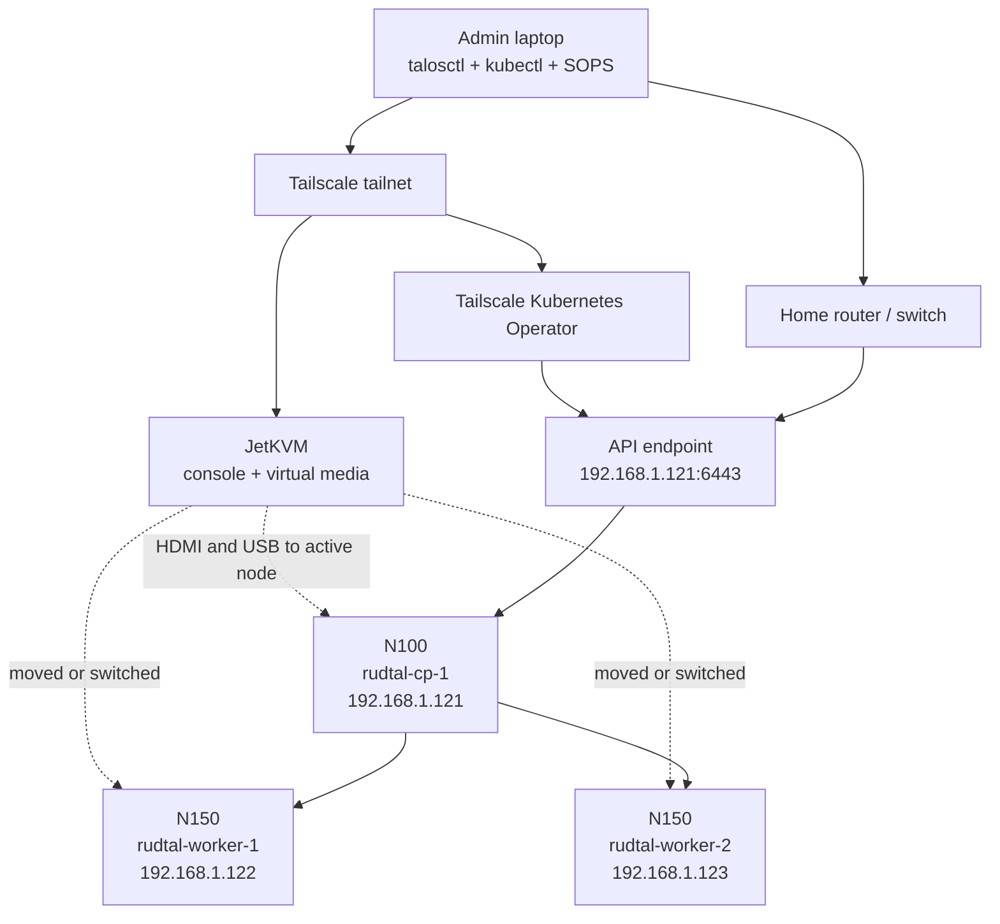

# Rudtal: rebuildable Talos learning lab

## Goal

Build a small Talos Kubernetes cluster that is safe to experiment with, can be
destroyed without regret, and can be rebuilt from the declarative inputs in this
repository. Use Tailscale for remote Kubernetes and service access. Learn Talos,
Kubernetes, networking, PKI, and GitOps in layers so failures remain understandable.

This plan assumes three machines: two NucBox G3 Plus N150 systems and one NucBox
G3 N100 system. The old address plan suggests `192.168.1.121` through
`192.168.1.123`; every address still needs to be checked against the router before
it is reused.

## Recommended architecture



Run one physical machine as a schedulable Talos control-plane node and the other
two as workers. This runs only one copy of etcd and the Kubernetes control-plane
components while retaining all three machines for workloads. The N100 is the
provisional control-plane choice so the slightly faster N150 systems are workers;
disk health and network reliability take priority when the hardware is inventoried.

The trade-off is deliberate: if the control-plane node is unavailable, existing
workloads may continue running but the Kubernetes API, scheduling and controllers
are unavailable until it returns. That is acceptable for this disposable lab and
JetKVM makes recovery practical. Never use two control-plane nodes: etcd would
require both for quorum, so it adds overhead without tolerating a failure. A later
three-control-plane exercise can measure the real overhead and demonstrate quorum
and API failover before deciding whether availability is worth it.

The Kubernetes API initially uses the single control-plane address, optionally
with `api.rudtal.home.arpa` pointing to it. A layer-2 API VIP becomes useful only
if the lab is deliberately converted to three control-plane nodes. All addresses
remain provisional until DHCP reservations and the router's pool are checked.

Start with Talos' default Flannel CNI as a known-good baseline. Establish GitOps
while Flannel is healthy, then test Cilium in a disposable rebuild before adding
Tailscale and other platform services. Keep the first Cilium pass with kube-proxy
enabled; treat kube-proxy replacement as a separate experiment. Use simple local
storage for disposable workloads initially; distributed storage is a separate
project and is likely to consume more of these four-core systems than it teaches
in the first iteration.

Connect JetKVM directly to the tailnet and use it as the out-of-band console and
virtual installation drive. This remains available when Talos or Kubernetes is
unhealthy. One JetKVM controls one attached target at a time unless a compatible
KVM switch is added, so the working assumption is that it will be moved between
nodes during the first build.

Tailscale should also run as the Kubernetes Operator. It can expose selected
services and proxy the Kubernetes API to the tailnet. Neither the operator nor
ordinary Tailscale access to JetKVM provides a route to the Talos API when
Kubernetes itself is down. For remote `talosctl` access, optionally add a Tailscale
subnet router on an independent always-on device. Do not expose ports 50000 or
6443 on the public internet.

## Version baseline

Pin versions in the repository rather than using `latest`:

- Talos Linux: `v1.12.12`
- Kubernetes: `v1.35.8`
- Architecture for the mini PCs: `amd64`

These are the current stable Talos release and its bundled Kubernetes version as
of 2026-09-05. The global `talosctl` is `v1.11.1`; an exact, checksum-verified
v1.12.12 client is available at
`downloads/talosctl-v1.12.12-darwin-arm64`. Use that binary for this cluster.
Update versions deliberately in a separate change after reading the relevant
upgrade notes.

## Repository contract

The durable source should eventually have this shape:

```text
.
├── README.md
├── PROJECT_PLAN.md
├── SECURITY.md
├── versions.env
├── talos/
│   ├── patches/
│   │   ├── common.yaml
│   │   ├── controlplane.yaml
│   │   ├── worker.yaml
│   │   └── nodes/
│   │       ├── rudtal-cp-1.yaml
│   │       ├── rudtal-worker-1.yaml
│   │       └── rudtal-worker-2.yaml
│   └── secrets.sops.yaml
├── clusters/
│   └── rudtal/               # Flux sync root and cluster-specific Kustomization
├── infrastructure/           # Cilium, Tailscale and other platform releases
├── apps/                      # disposable application workloads
├── scripts/
│   ├── render.sh
│   ├── validate.sh
│   └── reset.sh
└── generated/                 # ignored; machine configs and client configs
```

Commit intent: version pins, machine patches, non-secret network assignments,
Tailscale policy snippets, Kubernetes manifests, scripts, and documentation.
Never commit rendered Talos machine configs, `talosconfig`, `kubeconfig`, plaintext
Talos secrets, age private keys, Tailscale OAuth secrets, or application secrets.

The preferred lab compromise is a private Git repository with a SOPS-encrypted
Talos secrets bundle and SOPS-encrypted Kubernetes secrets. Keep the age private
identity outside the repository and back it up in a password manager. This makes
the same cluster identity reproducible. Generating a fresh secret bundle instead
creates a new cluster identity, which is appropriate for a complete security reset.

## Learning path

### 0. Inventory and safety boundary

Record each machine's RAM, SSD model and size, wired NIC MAC address, firmware
version, and the disk name Talos sees. Confirm that all three internal drives may
be erased. Reserve node addresses outside the DHCP pool. Confirm wired
Ethernet connectivity, DNS and NTP access, and that the router has no inbound port
forwarding to the nodes. Record JetKVM's address, firmware and recovery method;
enable its local password and place it under a dedicated tailnet tag.

Exit criterion: an inventory table and approved address plan exist in Git, with no
secret material in the repository index.

### 1. Disposable virtual rehearsal

Upgrade `talosctl`, install QEMU on the ARM Mac if needed, and create a small local
QEMU Talos cluster. Practice the lifecycle manually: create, inspect services and
resources, bootstrap, obtain a kubeconfig, deploy a test workload, and destroy the
cluster. Keep this exercise scriptable but separate from the physical cluster.

Exit criterion: the virtual cluster has been created and destroyed twice, and the
second run follows only the repository notes.

### 2. Build the reproducible configuration pipeline

Install SOPS and age. Generate one new Talos secrets bundle and encrypt it
immediately. Write small patches for the shared configuration, each role and each
node's hostname, static address, interface selector and install disk. Render full
machine configurations only into `generated/` using the pinned Talos and
Kubernetes versions.

Validate patches and rendered configuration before touching the machines. Read
the rendered diff when versions or patches change; generated files are discarded
after use.

Exit criterion: one control-plane config, two worker configs and a temporary
`talosconfig` can be reproduced from a clean checkout plus the external age
identity.

### 3. Install the physical cluster

Create an Image Factory `metal-amd64` installer for the pinned Talos version and
verify its checksum. Upload it to JetKVM, mount it in disk or CD/DVD mode, and boot
each mini PC from the read-only virtual drive into maintenance mode. Confirm the
node's disk and network identity before applying only that node's rendered
configuration. Unmount the installer after the node boots from its internal disk.
Bootstrap etcd exactly once for this initial cluster generation, then retrieve
a fresh kubeconfig and verify all nodes and system pods. A deliberate rebuild
creates a new generation and repeats that bootstrap exactly once.

Do the first installation interactively, one node at a time. Record observations
and fixes as patches or runbook changes rather than editing rendered YAML.

Exit criterion: all three nodes are Ready, a disposable workload is reachable on
the LAN, and the observed effect of stopping the control-plane node is documented.

### 4. Establish declarative Kubernetes management

Separate Talos machine configuration from Kubernetes add-on configuration. Use
Flux as the declarative control plane for the latter: bootstrap it once against
the healthy Flannel cluster, then manage its repositories, Kustomizations,
HelmReleases and encrypted Kubernetes secrets from Git. Record the bootstrap
credentials and the small imperative exception needed to install the first
networking layer before pods can run.

Exit criterion: a harmless Git-managed resource is reconciled, drift is repaired,
versions are pinned, and the repository clearly identifies Talos-owned versus
Kubernetes-owned state.

### 5. Replace Flannel with Cilium in a disposable rebuild

Create a branch or tag that preserves the Flannel baseline. Re-render Talos with
the CNI disabled, install a pinned Cilium chart with Talos-compatible settings,
and verify pod, service, DNS, NodePort and policy behavior. Keep kube-proxy for
the first pass; only after that works should a separate branch test Cilium's
kube-proxy replacement. If Flux cannot start before pod networking exists,
document the one-time Cilium bootstrap and hand ownership to Flux immediately.

Exit criterion: the Cilium branch is reproducible from Git, or it is discarded
cleanly with the Flannel baseline restored.

### 6. Add Tailscale with least privilege

Create dedicated tailnet tags for the operator and lab services. Create a separate
OAuth client for this cluster with only the scopes required by the operator, store
its secret encrypted, and install the operator with Helm. First expose one test
service; then enable the Kubernetes API proxy and bind the specific tailnet user or
group through Kubernetes RBAC.

Start with lab `cluster-admin` access only long enough to understand the identity
flow, then replace it with a narrower admin role. Test access from a device that is
outside the home LAN. Plan an independent subnet router only if remote Talos-level
recovery is desired.

Exit criterion: no router port forward exists, a named tailnet identity can reach
the test service and Kubernetes API, and an unauthorized identity cannot.

### 7. Add cluster services gradually

Add one component at a time with a validation checkpoint: a load-balancer address
  pool, ingress or Gateway API, a simple local storage provisioner and metrics. Keep
  test workloads stateless until backup and restore
are a deliberate learning objective.

Exit criterion: each component has a pinned version, a Git-managed manifest or
release definition, and a documented removal path.

### 8. Prove rebuildability

Export no state from the running cluster. Destroy it, re-enter maintenance mode,
render configuration from the repository, reinstall all three nodes, and restore
the platform components from Git. Time the process and amend the runbook wherever
memory or guesswork was required.

Exit criterion: a clean rebuild succeeds using Git plus the external age identity,
and rotating to a brand-new cluster identity is also documented.

### 9. Prove credential recovery through 1Password

Store the dedicated SOPS age identity in a purpose-specific 1Password item and
test recovery from a second trusted machine. Prefer the SOPS
`SOPS_AGE_KEY_CMD` interface with a repository helper that invokes `op read`, so
the private identity flows directly to SOPS instead of being permanently restored
to the filesystem. Retain a documented `op read --out-file` fallback with mode
0600 for environments where command-based integration is unavailable.

Do not back up generated `talosconfig` or `kubeconfig` as the primary recovery
mechanism. Reproduce `talosconfig` from the encrypted Talos identity and retrieve a
fresh kubeconfig from the cluster. The recovery test must use the private Git
repository plus 1Password from a machine that has no existing Rudtal age key.

Exit criterion: the cross-machine procedure decrypt-tests without displaying
plaintext, renders a valid ignored configuration, documents rotation and lost
access, and fails as expected when 1Password access is removed.

### 10. Curate the long-lived repository

After every operational and recovery path has been exercised, consolidate the
working documents into a durable `docs/` tree. Keep the root focused on the
operator entry point, agent instructions, version/encryption policy and live
configuration. Archive completed plans and session status separately from the
authoritative architecture, security and runbooks. Preserve Flux and Talos paths
unless their consumers are migrated and verified in the same change.

Exit criterion: a clean clone has one discoverable procedure per routine task,
all links and configuration builds validate, credential-shaped history has been
reviewed safely, and Flux remains healthy on the unchanged sync path.

## Decisions to confirm before implementation

1. Confirm the inventory is two N150 machines plus one N100 machine, and provide
   the RAM and storage fitted to each.
2. Confirm all three internal disks may be wiped.
3. Choose the repository visibility. Private Git plus SOPS is recommended.
4. Confirm whether the old `192.168.1.121-123` addresses are reserved and whether
   `192.168.1.121` can be the initial Kubernetes API endpoint.
5. Identify an independent always-on device for a future Tailscale subnet router,
   if remote `talosctl` access matters in addition to JetKVM console recovery. The
   old files mention a QNAP device; note whether it is still available.

## Implementation sessions

The original broad implementation session has been divided into bounded handoffs
in `SESSION_PLAN.md`. `STATUS.md` identifies the exact current checkpoint. This
keeps physical changes, secret creation, bootstrap, worker installation and
Tailscale work independently reviewable across Codex and Claude Code sessions.
