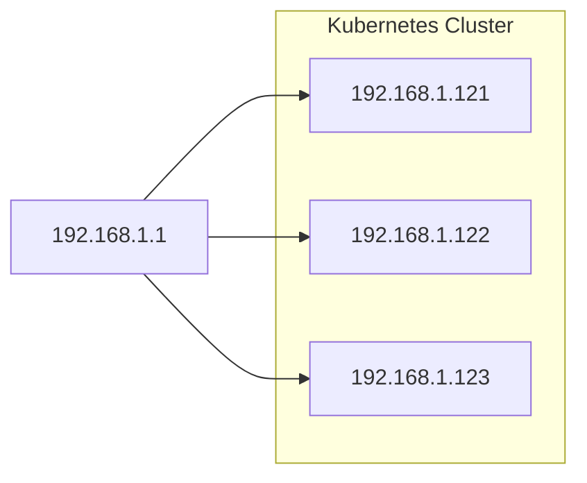

# rudtal01

```mermaid
graph LR
    Gateway[192.168.1.1] --> Node1[192.168.1.121]
    Gateway --> Node2[192.168.1.122]
    Gateway --> Node3[192.168.1.123]

    subgraph Kubernetes Cluster
        Node1
        Node2
        Node3
    end

    class Gateway gateway;
```
